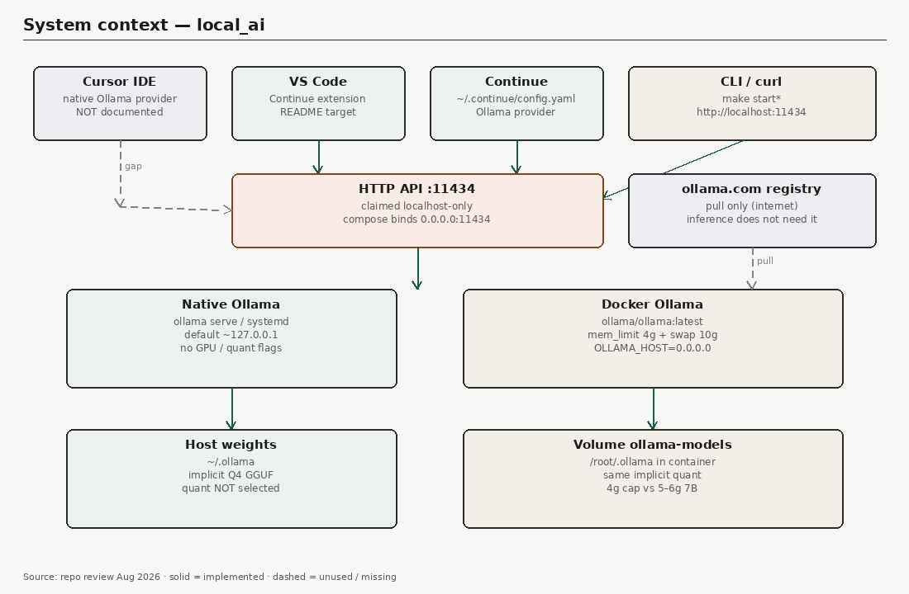
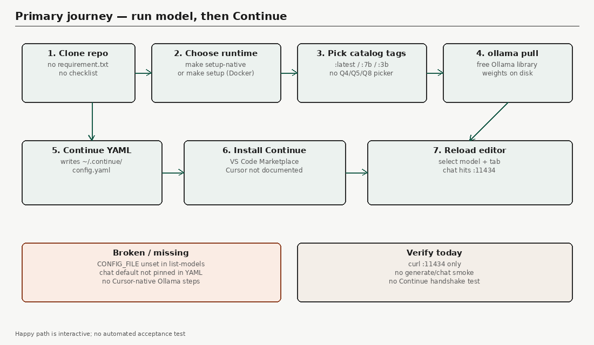
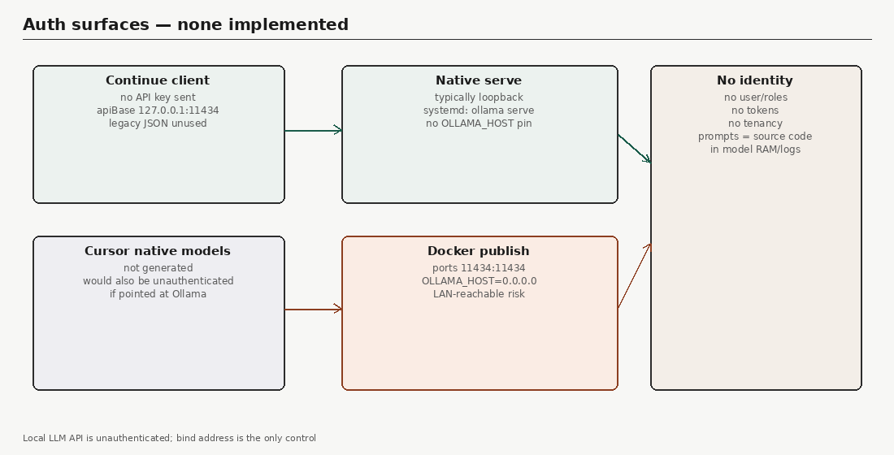
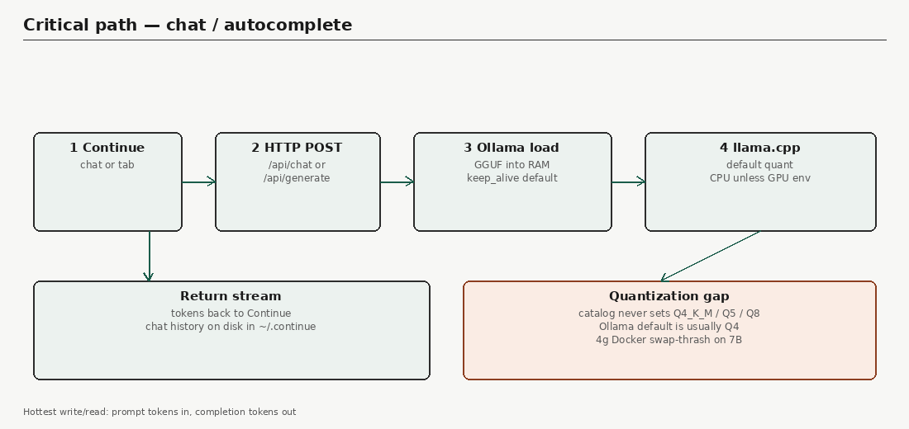

# DEVELOPMENT_CHECKLIST — local_ai hardening track

**Product done:** a free, explicitly quantized Ollama model answers `curl` on loopback and Continue works in VS Code and Cursor.  
**Production ready:** loopback bind, RAM/quant gates, smoke generate, honest CI, tracked spec. README `[x]` is not proof.

Inspected basis: architecture review 24 Aug 2026 (Ollama native + Docker, `scripts/models.json`, `generate_continue_config.sh`).

Flow diagrams (review Part A):

- 
- 
- 
- 

Note: `docs/` is gitignored until Phase 7. PNGs live at `docs/images/` locally.

## Suggested agent order

Phase 1 → 2 → 3 → 4 → 5 → 6 → 7 → 8. Do not start N+1 until N exit is marked and the user asks.

## Summary

| Phase | Name | Priority | Status | Items | Estimate |
|------:|------|----------|--------|------:|----------|
| 1 | Quant catalog | P0 | ✅ DONE | 8 | 1 day |
| 2 | Loopback and memory honesty | P0 | ✅ DONE | 7 | 0.5 day |
| 3 | Cursor and VS Code Continue | P0 | ✅ DONE | 8 | 1 day |
| 4 | Serve/generate smoke | P1 | ✅ DONE | 6 | 0.5 day |
| 5 | Fix list-models / YAML | P1 | ⚪ TODO | 5 | 0.5 day |
| 6 | Stop daemon.json smash | P1 | ⚪ TODO | 5 | 0.5 day |
| 7 | Spec, docs track, honest CI | P2 | ⚪ TODO | 7 | 0.5 day |
| 8 | Collapse native/Docker dup | P2 | ⚪ TODO | 6 | 1.5 days |

## GLOBAL AGENT RULES

| Rule | Intent |
|------|--------|
| Do not add a second inference stack (vLLM, raw llama.cpp server, LM Studio, llamafile, Open WebUI) | Keep Ollama as the only runtime |
| Preserve HTTP contract on `127.0.0.1:11434` (Ollama API) | Continue and curl keep working |
| Free Ollama-library models only; no paid API providers | User requirement |
| Quantization must be explicit in catalog tags (Q4_K_M / Q5_K_M / Q8_0 or equivalent Ollama tag) | User requirement |
| Do not rename existing `models.json` keys; add fields or new entries | Scripts keep matching keys |
| Preserve existing `make` target names; add new targets only when a phase names them | Operator muscle memory |
| Do not overwrite unrelated host config (`/etc/docker/daemon.json`, global Ollama install flags) unless the phase is exactly that rollback | Host safety |
| Honest checklist: `[x]` only after the named file/behavior exists | No aspirational complete |
| One phase at a time; run that phase’s smoke before `[x]` | Execution discipline |
| Smallest diff; no drive-by README rewrites outside the phase | Reviewability |
| Continue config remains YAML at `~/.continue/config.yaml` with `provider: ollama` | Editor contract |
| Do not commit secrets, `.env`, or live `~/.continue` chats | Safety |

## Regression must-pass matrix (every phase)

| Flow | Must still work |
|------|-----------------|
| `make help` | Lists current targets; no broken recipes |
| `bash -n scripts/*.sh` | All scripts parse |
| `python3 -m json.tool scripts/models.json` | Valid JSON |
| `docker compose config` | Compose file valid |
| Native path | `make start-native` / `stop-native` still start/stop host Ollama when CLI exists |
| Docker path | `make start` / `stop` still start/stop `ollama-server` when Docker exists |
| Continue writer | `scripts/generate_continue_config.sh --help` works; output still `provider: ollama` and `apiBase` loopback |
| Catalog pull | Previously listed model keys still resolve to an `ollamaTag` that `ollama pull` can use (or a documented alias) |
| Autocomplete block | Generated YAML still has `tabAutocompleteModel` |
| Unload | `make unload-models-native` still issues `keep_alive: 0` |

---

## Phase 1: Quant catalog (P0)

**Status:** ✅ DONE  
**Prerequisites:** none  
**Estimated effort:** 1 day

### What will change
- `scripts/models.json` — add `quantization` (e.g. `Q4_K_M`), keep `ollamaTag` as a **verified** quant-specific tag
- `scripts/model_utils.sh`, `scripts/model_utils_native.sh` — menu shows quant + RAM
- `scripts/setup_ollama_docker.sh`, `scripts/setup_ollama_native.sh`, `scripts/add_model.sh`, `scripts/add_model_native.sh` — refuse or warn when required RAM exceeds Docker `mem_limit` / detected host RAM
- `README.md` — Available Models table includes quant column; state that `:latest` is not the target

### What must NOT change / break
- Ollama remains the only pull/serve mechanism
- Existing make targets and script names
- Continue YAML schema (`schema: v1`, `provider: ollama`)
- Ability to run TinyLlama / phi3-mini class models on ~8–16GB hosts
- Docker volume name `ollama-models` and native `~/.ollama` storage

### Guardrails for agent
- **Do not** add llama.cpp, vLLM, or extra UIs.
- **Do not** invent Ollama tags. Verify each tag with `ollama pull` dry knowledge: check library naming (`-instruct-q4_K_M` etc.) or `ollama show` after a test pull; drop any tag that 404s.
- **Do not** replace the whole catalog with new model families; extend current entries with explicit quants. Extra Q5/Q8 rows only if the same family already exists.
- Prefer Q4_K_M (or the library’s documented default Q4) for 7B chat; smaller Q4/Q4_K_S for autocomplete.
- **Do not** change `docker-compose.yml` bind/memory in this phase (Phase 2).

### 1.1 — Catalog schema

- [x] **1.1.1** Add per-model fields: `quantization`, `ollamaTag` (quant-specific), keep `size` / `memoryRequired` honest for that quant
- [x] **1.1.2** Default chat 7B entries use an explicit Q4 tag, not `:latest`, after tag verification
- [x] **1.1.3** Autocomplete entries (tinyllama, phi, phi3-mini, qwen 3b) use explicit small Q4 tags

### 1.2 — Operator display and RAM gate

- [x] **1.2.1** Model menus print `Quant: Q4_K_M` (or actual) beside size/memory
- [x] **1.2.2** Before pull, compare `memoryRequired` to Docker `mem_limit` (docker mode) or `/proc/meminfo` MemAvailable (native); abort 7B pull when over cap with a one-line reason
- [x] **1.2.3** README model table lists quant; remove implication that unnamed `:latest` is the performance target

### 1.3 — Exit

- [x] **1.3.1** `python3 -m json.tool scripts/models.json` passes; `bash -n` on touched scripts
- [x] **1.3.2** Document honesty: Ollama still may remap tags internally; catalog **names** the quant we request
- [x] **1.3.3** Mark Phase 1 complete only if at least one verified Q4 tag is the documented default for a 7B chat model

---

## Phase 2: Loopback and memory honesty (P0)

**Status:** ✅ DONE  
**Goal:** API is loopback-only; Docker memory limits match what Phase 1 will actually load; README matches compose.  
**Prerequisites:** Phase 1 (quant RAM numbers exist)  
**Estimated effort:** 0.5 day

### What will change
- `docker-compose.yml` — publish `127.0.0.1:11434:11434` not `11434:11434`
- `scripts/start_dev_environment.sh` fallback `docker run -p` — same loopback publish
- `scripts/enable_ollama_autostart_ubuntu.sh` — `Environment=OLLAMA_HOST=127.0.0.1:11434`
- `docker-compose.yml` `mem_limit` / `memswap_limit` — either raise to fit documented Q4 7B **or** keep 4g and document that 7B Docker is unsupported (match Phase 1 gate)
- `README.md` — stop claiming “local only” unless compose binds loopback; memory section matches file

### What must NOT change / break
- Port number **11434**
- Volume `ollama-models`
- Native `ollama serve` still reachable at `http://127.0.0.1:11434`
- Continue `apiBase: http://127.0.0.1:11434`
- Restart policy and image name (pin digest is optional, not required here)

### Guardrails for agent
- **Do not** add API keys, reverse proxies, or auth plugins.
- **Do not** set `OLLAMA_HOST=0.0.0.0` on the host systemd unit.
- **Do not** edit `/etc/docker/daemon.json` (Phase 6).
- Prefer native for 7B if Docker stays at 4g; say so in README, do not silently swap-thrash.

### 2.1 — Bind address

- [x] **2.1.1** Compose and docker-run fallback bind `127.0.0.1:11434:11434`
- [x] **2.1.2** systemd unit sets `OLLAMA_HOST=127.0.0.1:11434`
- [x] **2.1.3** README Architecture/port sentences match the files

### 2.2 — Memory vs quant

- [x] **2.2.1** If 7B Q4 remains in Docker catalog, `mem_limit` is ≥ catalog `memoryRequired` (no 4g vs 5–6g lie). Else Docker menu/gate blocks 7B (Phase 1 gate must agree)
- [x] **2.2.2** `memswap_limit` is not advertised as “performance”; README says swap = thrash

### 2.3 — Exit

- [x] **2.3.1** `docker compose config` shows host `127.0.0.1:11434`
- [x] **2.3.2** Mark Phase 2 complete; note if GPU is still unset (allowed)

---

## Phase 3: Cursor and VS Code Continue (P0)

**Status:** ✅ DONE  
**Goal:** After a model is healthy, Continue is configured for **both** VS Code and Cursor from the same YAML; chat default is the selected chat model.  
**Prerequisites:** Phase 1 (tags); Phase 2 optional but preferred for bind honesty  
**Estimated effort:** 1 day

### What will change
- `scripts/generate_continue_config.sh` — put `--chat` model **first** in `models:`; keep `tabAutocompleteModel` as `--autocomplete`; still `apiBase: http://127.0.0.1:11434`
- `scripts/setup_ollama_*.sh`, `scripts/switch_model*.sh` — next-step text names Cursor **and** VS Code
- `README.md` — section “Configure Continue in VS Code **and Cursor**”: install Continue (`Continue.continue`), reload, pick model; optional Cursor Settings → Models → Ollama `http://127.0.0.1:11434` (document only, do not generate a second config format)
- Setup complete message: do not say VS Code only

### What must NOT change / break
- Output path default `~/.continue/config.yaml`
- `schema: v1`, `provider: ollama`
- Backup of existing YAML (`*.backup`)
- `--mode native|docker`, `--models`, `--single` flags
- No Cursor-only proprietary plugin requirement beyond Continue + optional native Ollama provider

### Guardrails for agent
- **Do not** invent Cursor `settings.json` blobs unless copied from current Cursor docs you fetch; prefer Continue YAML as the supported path.
- **Do not** resurrect `continue_config.json` as the live config (leave as legacy or delete only if README stops referencing it as active — deleting is allowed if README is updated in this phase).
- **Do not** point Continue at cloud providers.
- Prefer documenting Continue-in-Cursor over building a new editor integration.

### 3.1 — YAML contract

- [x] **3.1.1** Chat model is first in `models:` so Continue default chat matches `--chat`
- [x] **3.1.2** Autocomplete still only via `tabAutocompleteModel` (do not drop it)
- [x] **3.1.3** Printed summary still lists included / chat / autocomplete tags

### 3.2 — Editor docs

- [x] **3.2.1** README: VS Code Continue install + reload + model picker
- [x] **3.2.2** README: Cursor → Extensions → Continue (same ID) → same `~/.continue/config.yaml`
- [x] **3.2.3** README: optional Cursor native Ollama base URL; state Continue is the supported path
- [x] **3.2.4** Setup/switch echo text matches README (Cursor + VS Code)

### 3.3 — Exit

- [x] **3.3.1** Run generator against an installed tiny model (or fixture tags if offline) and confirm YAML order by reading the file
- [x] **3.3.2** Mark Phase 3 complete; honesty: no automated UI click-test of Continue in this phase (Phase 4 is API smoke)

---

## Phase 4: Serve/generate smoke (P1)

**Status:** ✅ DONE  
**Goal:** Do not write Continue config until a one-token generate succeeds on the chosen model.  
**Prerequisites:** Phase 1 (tags exist); Phase 3 (generator still the writer)  
**Estimated effort:** 0.5 day

### What will change
- New `scripts/smoke_ollama.sh` (or equivalent named in Makefile) — `POST http://127.0.0.1:11434/api/generate` with a tiny prompt, `keep_alive` 0 or short, timeout
- `scripts/generate_continue_config.sh` **or** setup/add/switch callers — run smoke for `--chat` (and autocomplete if different) before overwrite
- `Makefile` — `make smoke` / `make smoke-native` if needed
- Compose healthcheck: replace `curl` if the image lacks it; use `ollama` CLI or `wget` that exists in `ollama/ollama`

### What must NOT change / break
- Generate API path remains Ollama native `/api/generate` (not a new proxy)
- Unload script behavior
- Continue YAML shape
- CI must not pull multi-GB models on GitHub-hosted runners in this phase (local/manual smoke is enough unless a **tiny** tag is already cached)

### Guardrails for agent
- **Do not** add pytest/node stacks.
- **Do not** fail CI by pulling 7B on `ubuntu-latest`.
- **Do not** send real user source as the smoke prompt; use a fixed string e.g. `hi`.
- Prefer `keep_alive: 0` in smoke so RAM drops after the check.

### 4.1 — Smoke script

- [x] **4.1.1** Script exits non-zero if port down, model missing, or generate fails
- [x] **4.1.2** Setup/switch/generate refuse to write YAML when smoke fails (clear error)
- [x] **4.1.3** Healthcheck in compose does not use a missing `curl` binary

### 4.2 — Exit

- [ ] **4.2.1** `bash -n` on new/changed scripts; `make help` lists smoke if added
- [ ] **4.2.2** Mark Phase 4 complete; honesty: Continue UI handshake still untested

---

## Phase 5: Fix list-models / YAML (P1)

**Status:** ⚪ TODO  
**Goal:** `make list-models` / `list-models-native` show Continue chat + autocomplete from `~/.continue/config.yaml` without unset `CONFIG_FILE` or `jq` on YAML.  
**Prerequisites:** Phase 3 (YAML layout known)  
**Estimated effort:** 0.5 day

### What will change
- `scripts/list_models.sh`, `scripts/list_models_native.sh` — set `CONFIG_FILE="${HOME}/.continue/config.yaml"`
- Parse YAML with `grep`/`awk` or `python3`, **not** `jq`
- Display chat (first `model:` under `models:` or documented field) and `tabAutocompleteModel` `model:`

### What must NOT change / break
- Menu of catalog models from `models.json`
- Docker stats block on docker list; `ollama ps` on native list
- Generator output format enough to parse (if you change parse, keep generator in sync; prefer parse-only here)

### Guardrails for agent
- **Do not** convert Continue config back to JSON.
- **Do not** add a Python package dependency.
- **Do not** start Ollama just to print a missing config (native list today starts the server — do not make that worse; starting to list **installed** models is OK).

### 5.1 — Read path

- [ ] **5.1.1** Define `CONFIG_FILE`; if missing, print path and skip Continue section (no empty `jq` error)
- [ ] **5.1.2** Parse YAML; print chat + autocomplete tags
- [ ] **5.1.3** `bash -n` both list scripts

### 5.2 — Exit

- [ ] **5.2.1** With a generated YAML fixture in a temp `--output` file, parser finds the expected tags (document the one-liner used)
- [ ] **5.2.2** Mark Phase 5 complete

---

## Phase 6: Stop daemon.json smash (P1)

**Status:** ⚪ TODO  
**Goal:** Setup never overwrites host `/etc/docker/daemon.json` with a 4g global memory cap.  
**Prerequisites:** Phase 2 (container limits are the control plane)  
**Estimated effort:** 0.5 day

### What will change
- `scripts/setup_ollama_docker.sh` — remove `sudo tee` of full daemon.json (or make it an explicit opt-in that **merges** and never lowers unrelated keys)
- `README.md` / `Makefile` help — remove “auto-configured daemon.json 4GB” as a feature
- Container `mem_limit` remains the only default memory control

### What must NOT change / break
- Docker compose up/pull/volume create
- Interactive model selection after container is up
- Users who already have a custom daemon.json

### Guardrails for agent
- **Do not** write `/etc/docker/daemon.json` by default.
- **Do not** `systemctl restart docker` from setup.
- Prefer delete of that block over a clever merge unless merge is tested.

### 6.1 — Setup

- [ ] **6.1.1** Remove or gate daemon.json mutation
- [ ] **6.1.2** README Memory Configuration matches (container-only)
- [ ] **6.1.3** `bash -n scripts/setup_ollama_docker.sh`

### 6.2 — Exit

- [ ] **6.2.1** Grep setup script: no unconditional write to `/etc/docker/daemon.json`
- [ ] **6.2.2** Mark Phase 6 complete

---

## Phase 7: Spec, docs track, honest CI (P2)

**Status:** ⚪ TODO  
**Goal:** Requirements and checklist can be git-tracked; CI does not print PASSED when jobs failed.  
**Prerequisites:** none strictly; better after Phases 1–3 so spec matches code  
**Estimated effort:** 0.5 day

### What will change
- `.gitignore` — stop ignoring all of `docs/` (ignore only secrets/local if needed)
- `docs/requirement.txt` — product name, in-scope (local quantized Ollama, Continue in Cursor/VS Code), out-of-scope (cloud APIs, second engines)
- This checklist file tracked (root `DEVELOPMENT_CHECKLIST.md` and/or `docs/DEVELOPMENT_CHECKLIST.md`)
- `.github/workflows/ci.yml` — `summary` job fails if any `needs` job failed; do not echo PASSED unconditionally; markdown-lint should not hide failure if we claim lint is required

### What must NOT change / break
- Existing lint-and-validate steps (compose config, `bash -n`, JSON, `make help`)
- No new required GitHub secrets
- Still no 7B pull on CI runners

### Guardrails for agent
- **Do not** add a web app, auth, or SMTP from the generic requirement example.
- **Do not** mark security-scan as passing if it only `grep || true`.
- Prefer failing summary on failed needs over adding noisy jobs.

### 7.1 — Spec

- [ ] **7.1.1** `docs/requirement.txt` filled from the two user goals (quantized local models; Continue in Cursor + VS Code)
- [ ] **7.1.2** `.gitignore` allows `docs/requirement.txt`, `docs/DEVELOPMENT_CHECKLIST.md`, `docs/images/`
- [ ] **7.1.3** Link review diagrams from checklist if those PNGs are kept

### 7.2 — CI honesty

- [ ] **7.2.1** Summary job: exit 1 if any needed job failed
- [ ] **7.2.2** Remove or fix “Ready for deployment” when only syntax was checked

### 7.3 — Exit

- [ ] **7.3.1** Workflow YAML still valid; document that CI ≠ model smoke on GH runners
- [ ] **7.3.2** Mark Phase 7 complete

---

## Phase 8: Collapse native/Docker dup (P2)

**Status:** ⚪ TODO  
**Goal:** One shared helper for catalog parse, menus, Continue generate, smoke; thin native vs docker wrappers.  
**Prerequisites:** Phases 1–5 (behavior frozen)  
**Estimated effort:** 1.5 days

### What will change
- Shared `scripts/model_utils.sh` (or split `scripts/lib/`) used by both paths
- Wrappers keep `make *-native` / `make *` names
- Delete dead duplication only after wrappers call the shared functions

### What must NOT change / break
- Every make target name in current `Makefile`
- Native vs docker **behavior** (exec `docker exec ollama` vs host `ollama`)
- Continue output path and flags
- systemd enable/disable scripts stay Ubuntu-only

### Guardrails for agent
- **Do not** merge into a single `make setup` that drops native or docker.
- **Do not** rewrite in another language.
- Prefer extracting functions over a large redesign. Stop if a wrapper would change pull semantics.

### 8.1 — Extract

- [ ] **8.1.1** Shared JSON/menu/RAM-gate/smoke/continue-call helpers
- [ ] **8.1.2** Docker and native scripts become thin; `bash -n` all scripts
- [ ] **8.1.3** `make help` still documents both paths

### 8.2 — Exit

- [ ] **8.2.1** Regression matrix commands pass
- [ ] **8.2.2** Mark Phase 8 complete; honesty: two runtimes remain, only code dup is gone

---

## Per-phase kickoff (paste when implementing)

```text
Implement only Phase N from DEVELOPMENT_CHECKLIST. Read that phase’s
What will change, What must NOT break, and Guardrails first.
Do not start Phase N+1. Do not expand scope.
Run targeted tests before marking items [x].
Update checklist checkboxes for completed items only.
```

Replace `N` with `1` … `8`.
